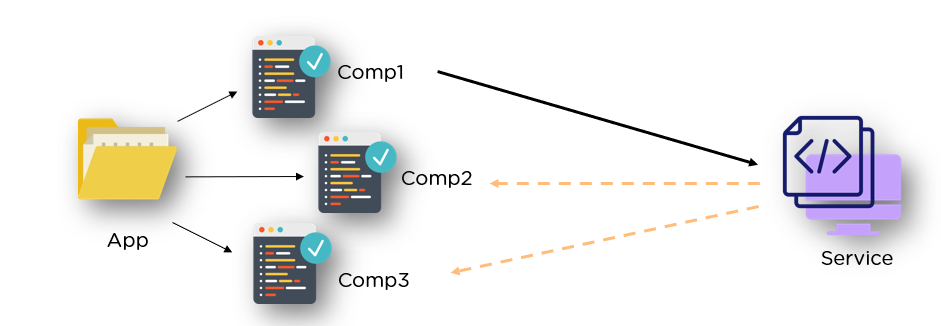

# Serviços em Angular!



<p align="center">
     Sumário
      <p align="center">
  <a href="#sobre"> Sobre </a> |
  <a href="#como-criar-um-serviço"> Como criar um serviço? </a> |
  <a href="#observação"> Observação </a>      
       <br />
    <br />
    <h1 align="center">
 </h1>
  </p>
</p>

This project was generated with [Angular CLI](https://github.com/angular/angular-cli) version 6.0.0.
## Sobre 
<p>Os serviços podem ser uma forma de centralizar uma lógica, ou o armazenamento de dados e também de implementar comunicação entre componentes. Ou seja, quando você tem um código duplicado, que ocorre em diferentes lugares de uma aplicação Angular, um serviço pode ajudar terceirizando e centralizando a execução desse código.</p>

## Como criar um serviço?

<p>Para criar um serviço é necessário criar uma classe c/ a extensão '.service.ts'. Dentro desta classe você pode construir o seu código. Os serviços em Angular, podem e devem ser usados nos componentes, mas não é uma boa prática instanciar a classe do serviço manualmente sempre que for utilizá-lo.</p>

```javascript
    export class AccountService {

        accounts = [
            {
            name: 'Master Account',
            status: 'active'
            },
            {
            name: 'Testaccount',
            status: 'inactive'
            },
            {
            name: 'Hidden Account',
            status: 'unknown'
            }
        ];

        onAccountAdded(name: string, status: string) {
            this.accounts.push({name: name, status: status});
        }
        
        onStatusChanged(id: number, newStatus: string) {
            this.accounts[id].status = newStatus;
        }
    } 
```

<p> Para isso, o Angular tem uma ótima ferramenta que dá acesso aos serviços sem precisar instanciar a classe do referido serviço manualmente nos componentes, o injetor de dependências. Uma dependência é algo que uma classe depende, por exemplo, nessa aplicação o componente de nova conta depende de um método do serviço de conta. O injetor de dependências Angular injeta a classe do serviço automaticamente em um componente e, além disso, funciona de maneira hierárquica, ou seja, de cima para baixo. O nível mais alto em que um serviço pode ser injetado é no app.module.ts</p>

```javascript
    @NgModule({
    declarations: [
        AppComponent,
        AccountComponent,
        NewAccountComponent
    ],
    imports: [
        BrowserModule,
        FormsModule,
    ],
    providers: [AccountService, LoggingService], <-------- injeta o serviço no nível mais alto
    bootstrap: [AppComponent]
    })
```
<p>Dessa maneira, a instancia da classe de um serviço fica disponível para toda aplicação, ou seja, todos os componentes poderão utilizar uma única instância desses serviços. Nos casos em que um serviço, irá ser utilizado apenas em alguns componentes e não em toda a aplicação, a injeção pode ser feita no componente pai dos componentes que precisarão da instancia do serviço.</p>

```javascript
    @Component({
        selector: 'app-account',
        templateUrl: './account.component.html',
        styleUrls: ['./account.component.css'],
        providers: [LoggingService], <--------- injeta o serviço no nível de um único componente/ de seus componentes filhos
    })
```

<h3>Observação:</h3>
<p> 1 - No exemplo acima, o componente './account.component.html' não é pai de nenhum outro componente, mas a nível de demonstração, a injeção do serviço deveria ocorrer dessa maneira</p>
<p> 2 - Os serviços não se propagam, eles apenas descem na árvore de componentes. É uma única instancia que desce na árvore entre os componentes. O nível mais baixo, portanto, é um componente único que depende de um serviço, sem componentes filhos.</p>

<p>Feito isso, os componentes que estiverem abaixo do componente 'app-account' que recebeu a injeção do serviço, poderão utilizar e executar tudo que foi construído dentro da classe do serviço [LoggingService]. Mas para isso é preciso informar ao Angular que precisamos da instancia do serviço em um determinado componente:</p>

```javascript
    constructor(private logging: LoggingService, private accountService: AccountService) {

    }
```

<p>Dessa maneira, quando o Angular constrói o componente, ele já cria uma instancia do serviço para ele.</p>

## Injetando serviços em serviços

<p>Para injetar um serviço em outro serviço, ou seja, utilizar um método ou qualquer outra parte de um serviço X em um serviço Y, é necessário que ambos estejam injetados no nível mais alto da aplicação, como mencionado anteriormente.</p>

<p>Primeiro, é necessário importar o serviço Y no serviço X e, dizer ao Angular que precisa da instância do serviço Y no serviço X:</p>

```javascript
// other service
import { LoggingService } from "./logging.service"; <------- Serviço Y

export class AccountService { <------ Serviço X

    accounts = [
        {
          name: 'Master Account',
          status: 'active'
        },
        {
          name: 'Testaccount',
          status: 'inactive'
        },
        {
          name: 'Hidden Account',
          status: 'unknown'
        }
      ];

      constructor(private logging: LoggingService) { <----- Diz ao Angular que precisa da instância do serviço Y no serviço X

      }

      onAccountAdded(name: string, status: string) {
        this.accounts.push({name: name, status: status});
        this.logging.changeStatus(status)
      }
    
      onStatusChanged(id: number, newStatus: string) {
        this.accounts[id].status = newStatus;
        this.logging.changeStatus(newStatus)
      }
} 
```
<p>No entanto, se esse código for utilizado dessa maneira, Angular retornará um erro. Isso ocorrerá, porque quando um serviço é injetado em algo, este algo precisa ter alguns metadados anexados à ele. Um componente em Angular, por exemplo, tem os seus metadados no '@Component'. Mas um serviço não tem um metadado, mas quando recebe a injeção de outro serviço ele precisa disso, de metadados específicos, para isso o Angular fornece o '@Injectable()'.</p>

```javascript
// other service
import { LoggingService } from "./logging.service";

@Injectable() <-------- Isso diz ao Angular que algo pode ser injetado aqui no serviço X

export class AccountService {

    accounts = [
        {
          name: 'Master Account',
          status: 'active'
        },
        {
          name: 'Testaccount',
          status: 'inactive'
        },
        {
          name: 'Hidden Account',
          status: 'unknown'
        }
      ];

      constructor(private logging: LoggingService) {

      }

      onAccountAdded(name: string, status: string) {
        this.accounts.push({name: name, status: status});
        this.logging.changeStatus(status) <----- métodos do serviço Y sendo utilizado na execução de um método do serviço X
      }
    
      onStatusChanged(id: number, newStatus: string) {
        this.accounts[id].status = newStatus;
        this.logging.changeStatus(newStatus) <----- métodos do serviço Y sendo utilizado na execução de um método do serviço X
      }
} 
```

<p> O @Injectable() sempre deve ser adicionado ao serviço no qual vc quer injetar algo, e não no serviço a ser injetado. Mas, em algumas versões do Angular é recomendado utilizá-lo nos dois serviços.</p>

## Utilizando serviços para comunicação entre componentes

<p>Para realizar a comunicação entre componentes utilizando um serviço, você pode por xemplo, criar um EventEmitter em seu serviço, e emitir o tipo que você precisa acessar em outros componentes:</p>

```javascript

// injectable
import { Injectable, EventEmitter } from "@angular/core";

// other service
import { LoggingService } from "./logging.service";

@Injectable()

export class AccountService {

    accounts = [
        {
          name: 'Master Account',
          status: 'active'
        },
        {
          name: 'Testaccount',
          status: 'inactive'
        },
        {
          name: 'Hidden Account',
          status: 'unknown'
        }
      ];

      constructor(private logging: LoggingService) {

      }

      updateStatus = new EventEmitter<string>(); <----- Evento que emite uma string

      onAccountAdded(name: string, status: string) {
        this.accounts.push({name: name, status: status});
        this.logging.changeStatus(status)
      }
    
      onStatusChanged(id: number, newStatus: string) {
        this.accounts[id].status = newStatus;
        this.logging.changeStatus(newStatus)
      }
} 
```

<p>Após isso, basta acionar a emissão desse evento em algum componente através da instância do serviço:</p>

```javascript
    export class AccountComponent {
        @Input() account: {name: string, status: string};
        @Input() id: number;

        constructor(private logging: LoggingService, private accountService: AccountService) { <------ diz ao Angular quais instâncias de serviço que este componente precisa

        }

        onSetTo(status: string) {
            this.accountService.onStatusChanged(this.id, status)
            // this.logging.changeStatus(status)
            this.accountService.updateStatus.emit(status) <------ aciona e emissão do evento do serviço
        }
    
    }
```

<p>E assinar/inscrever c/ o método subscribe() o que está sendo emitido, no componente que você deseja receber o dado/informação que foi emitido:<p>

```javascript
    export class NewAccountComponent {

        constructor (private logging: LoggingService, private accountService: AccountService) {

            this.accountService.updateStatus.subscribe(
            (status: string)=> alert("New status: " + status) <------- 
            );
        }
    } 
```

<p>Nos exemplos acima, no componente 'account', ao clicar em um dos botões que setam o estado da conta criada, o status dessa conta é emitido e no componente responsável por criar novas contas 'new-account', é recebido/assinado/ o status e acionado um alert.</p>

## Uma forma diferente de injetar serviços

<p> Para fornecer serviços em toda a aplicação de maneira mais eficiente, pensando em cenários em que os serviços forem utilizados em aplicações maiores, ao invés de adicionar uma classe de serviço ao providers[] array em AppModule, você pode definir a seguinte configuração em @Injectable():

```javascript
    @Injectable({providedIn: 'root'})
    export class MyService { ... }
```

<p>O uso desta sintaxe é totalmente opcional, a sintaxe tradicional (usando providers[]) também funcionará. Mas essa, oferece uma vantagem: os serviços podem ser carregados lentamente pelo Angular (nos bastidores) e o código redundante pode ser removido automaticamente. Isso pode levar a um melhor desempenho e velocidade de carregamento.</p>

## Conclusão
<p>Certifique-se de utilizar apenas uma quantidade necessária de instâncias de serviços, sempre que for injetar serviços em serviços certifique-se de fornecer os serviços no nível mais alto da aplicação e de utilizar o '@Injectable()'.</p>